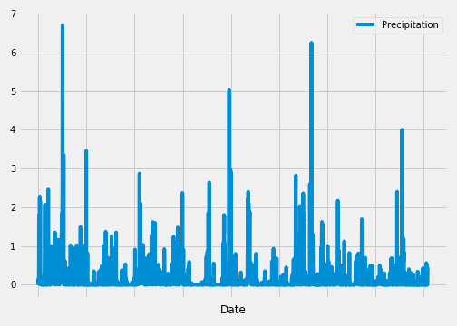
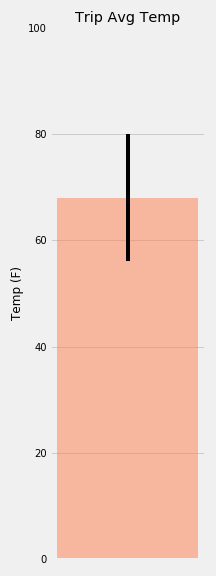
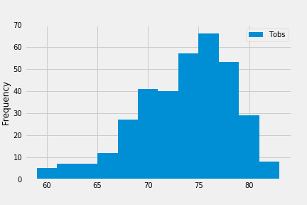
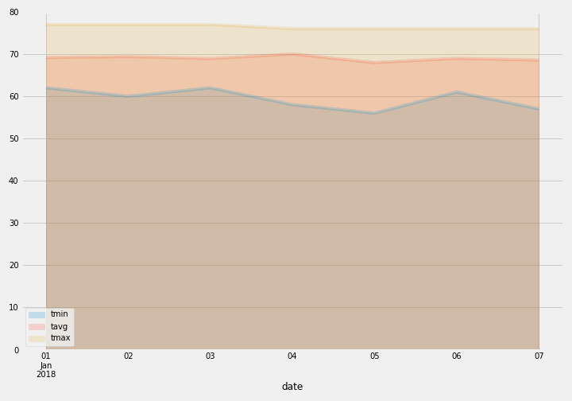

# sqlalchemy-challenge

Step 1 - Climate Analysis and Exploration

Using Python, SQLAlchemy ORM queries and Pandas to do basic climate analysis and data exploration of climate database. 

Step 2 - Climate App

After completing initial analysis, design a Flask API to created routes based on the queries developed.

Plotted the analysis using Matplotlib.

Precipitation Analysis

Temperature Analysis

Stations Analysis

Area Plot displaying daily normals

